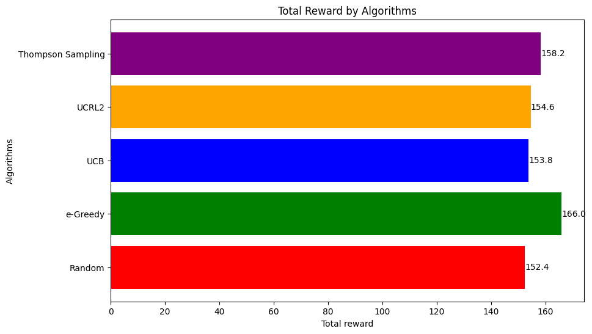

# Multi-arm Bandits Techniques In Online Advertising

## Authors
- Yi-Chun Huang
  
## Abstract
This research paper explores the application of multi-armed bandit algorithms in optimizing content recommendations on online media platforms. Our focus is on dynamic selection and adjustment of content recommendations to maximize advertising revenue. We compare different bandit algorithms with random approaches, emphasizing the effectiveness of the ϵ-greedy algorithm.

## Introduction
We address the need for effective content recommendation systems in online media platforms. The paper explores the exploration-exploitation trade-off in these systems using multi-armed bandit algorithms. 

## Methodology
Our study utilizes the Online Shoppers Purchasing Intention Dataset from UCL. We implement various multi-armed bandit algorithms, including the ϵ-greedy algorithm, Upper Confidence Bound (UCB), and Thompson Sampling, to optimize content recommendations in an online shopping context.

## Results/Analysis
Our experimental analysis reveals that the ϵ-greedy algorithm outperforms other techniques in terms of optimization. We present data on selection frequencies, regret comparisons, and total rewards achieved by different algorithms.

### Plots and Figures
Below are the key visualizations from our study:

#### Figure 1: Selection Frequencies of Different Arms

#### Figure 2: Regret of Different Algorithms

#### Figure 3: Total Reward by Algorithms

## Discussion
We discuss the performance of various algorithms, focusing on the balance between exploration and exploitation, and the implications of our findings in real-world recommendation systems.

## Conclusion
The ϵ-greedy algorithm demonstrates superior optimization capabilities in our study, highlighting its potential in online advertising strategies.

## Acknowledgements
Special thanks to the University of California, Irvine (UCI) for providing the dataset and to Lancaster University's SCC462 course for their support.

## References
<a id="1">[1]</a> R. C. Gatti, “A multi-armed bandit algorithm speeds up the evolution of cooperation,” Ecological Modelling, 2021.

<a id="1">[2]</a> N. Silva et al., “Multi-armed bandits in recommendation systems: A survey of the state-of-the-art,” Expert Systems with Applications, 2022.

<a id="1">[3]</a> D. I. Mattos et al., “Multi-armed bandits in the wild: Pitfalls and strategies in online experiments,” Information and Software Technology, 2019.

<a id="1">[4]</a> C. Yan et al., “Dynamic clustering based contextual combinatorial multi-armed bandit for online recommendation,” Knowledge-Based Systems, 2022.

<a id="1">[5]</a> C. O. Sakar et al., “Real-time prediction of online shoppers’ purchasing intention using multilayer perceptron and LSTM recurrent neural networks,” Neural Computing and Applications, 2019.

<a id="1">[6]</a> N. Radovic and M. Erceg, “Hardware implementation of the upper confidence-bound algorithm for reinforcement learning,” Computers & Electrical Engineering, 2021.

<a id="1">[7]</a> M. Kamiura and K. Sano, “Optimism in the face of uncertainty supported by a statistically-designed multi-armed bandit algorithm,” Biosystems, 2017.

<a id="1">[8]</a> A. Dzhoha and I. Rozora, “Multi-armed bandit problem with online clustering as side information,” Journal of Computational and Applied Mathematics, 2023.
